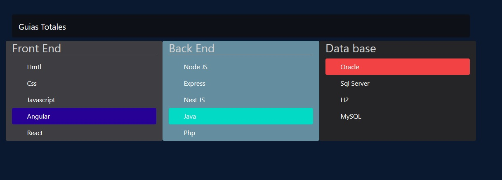

# ☕ 💠 Documentación de API Rest Hotel Softtek v1.0.0
## Descripción del proyecto

Este proyecto radica en la creación de una API Rest ...


## Recursos
El proyecto esta creado con las siguientes tecnologías, las primeras 4 se obtienen
al momento de crear el proyecto.


## Estructura 📁
```sh
├─── Controllers
└─── Services
```

## Accesos

Acceso a la base de datos H2 mediante URL:

```sh
url: http://localhost:8080/hotel-softtek/h2-console/
user: sa
password: 
```


Acceso a la UI de la documentación de la API mediante URL:
```sh
url: http://localhost:8080/hotel-softtek/swagger-ui/index.html#/
```


## Uso en Postman

### GET
```sh
http://localhost:8080/hotel-softtek/api/v1/huespedes
```

### POST (crear Huesped)
```sh
http://localhost:8080/hotel-softtek/api/v1/huespedes
```
Hay que insertar un JSON para esta petición.

``` json
{
    "nombre": "Juan",
    "apellido": "Pérez",
    "fechaNacimiento": "1990-05-15",
    "nacionalidad": "Mexicana",
    "telefono": "555-123-4567",
    "reservas": [
        {
            "fechaEntrada": "2024-07-10",
            "fechaSalida": "2024-07-11",
            "valor": 3500.0,
            "formaPago": "Tarjeta"
        },
        {
            "fechaEntrada": "2024-07-10",
            "fechaSalida": "2024-07-11",
            "valor": 300.0,
            "formaPago": "Tarjeta"
        }
    ]
}
```

### POST (editar Huesped)
```sh
http://localhost:8080/hotel-softtek/api/v1/huespedes/editar/1
```

Hay que insertar un JSON para esta petición.

``` json
 
```

### DELETE
```sh
http://localhost:8080/hotel-softtek/api/v1/huespedes/eliminar/1
```

## Referencias 📚

- * https://getbootstrap.com/docs/5.3/examples/sidebars/
- * https://alvaromontoro.com/blog/68033/new-html-element-search
- * Google - best colors for dark mode

- * 📹
- * YT - 

---
